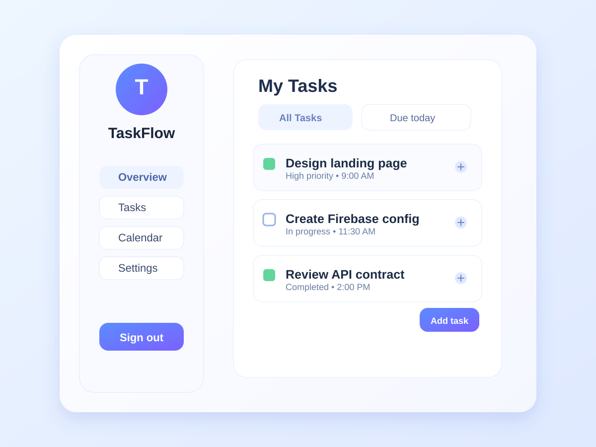

# Firebase Task Manager

A complete multi-screen Flutter task manager built with Firebase Authentication, Cloud Firestore, Provider, and dynamic Light/Dark themes.

## App preview



The screen above is a representative preview of the app interface. For submission, you can replace it with real screenshots or a short GIF/recording captured from your running app.

## Features implemented

- Firebase Auth: email/password sign in, sign up, sign out, and persistent `authStateChanges` screen protection.
- Firestore CRUD: tasks are stored under `users/{uid}/tasks`; the app creates, reads through a real-time stream, updates, and deletes tasks.
- Provider: `AuthProvider`, `TaskProvider`, and `ThemeProvider` keep business logic and data access out of widgets.
- Themes: custom Material 3 light and dark `ThemeData`, with a persistent toggle in the navigation drawer.
- UX: task filters, validation, edit dialog, swipe-to-delete confirmation, empty/error states, and responsive Material UI.

## Firebase setup

Follow these steps to configure Firebase for this project.

1. Create a Firebase project at https://console.firebase.google.com.
2. In the Firebase console, go to Authentication → Sign-in method and enable Email/Password.
3. Create a Cloud Firestore database in your Firebase project.
4. Install the Firebase CLI and FlutterFire tool if needed:

```bash
npm install -g firebase-tools
firebase login
dart pub global activate flutterfire_cli
```

5. From the repository root, run:

```bash
flutterfire configure
```

This generates the Firebase config for your platform(s) and creates `lib/firebase_options.dart` automatically.

6. Initialize Firebase in your app using the generated options. Update `lib/main.dart` like this:

```dart
import 'package:firebase_core/firebase_core.dart';
import 'firebase_options.dart';

Future<void> main() async {
  WidgetsFlutterBinding.ensureInitialized();
  await Firebase.initializeApp(
    options: DefaultFirebaseOptions.currentPlatform,
  );
  runApp(const MyApp());
}
```

If `lib/firebase_options.dart` is not present, run `flutterfire configure` again and ensure the project matches your Firebase project.

7. Add Firestore security rules so each user can only access their own task data:

```text
rules_version = '2';
service cloud.firestore {
  match /databases/{database}/documents {
    match /users/{userId}/tasks/{taskId} {
      allow read, write: if request.auth != null
        && request.auth.uid == userId;
    }
  }
}
```

## Run the app

```bash
flutter pub get
flutter analyze
flutter test
flutter run
```

Then:
- Create an account
- Add a task
- Edit a task
- Mark a task complete
- Delete a task with swipe action
- Sign out and back in
- Switch between light and dark mode

## Screenshots / recording

You can add real screenshots in the `screenshots/` folder and reference them here.

Example:

```markdown


```

This repository includes a preview image at:

- `screenshots/task-manager-preview.svg`

## Project structure

```text
lib/
├── main.dart
├── models/
│   └── task.dart
├── providers/
│   ├── auth_provider.dart
│   ├── task_provider.dart
│   └── theme_provider.dart
├── screens/
│   ├── auth_screen.dart
│   └── home_screen.dart
├── services/
│   ├── auth_service.dart
│   └── task_service.dart
├── theme/
│   └── app_theme.dart
└── firebase_options.dart
```

## License

This project is for educational/demo use and is suitable for submission or adaptation.
